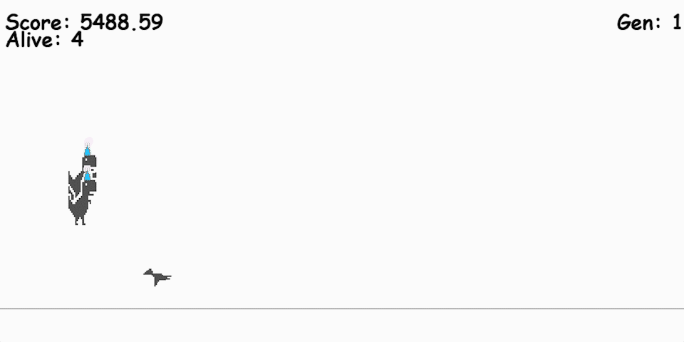

# DinoGame
This project contains an implementation of the [Chrome T-Rex Dinosaur Game](https://en.wikipedia.org/wiki/Dinosaur_Game) in [pygame](https://www.pygame.org/), employing learning through the [NEAT-python package](https://neat-python.readthedocs.io/en/latest/).

<p align="center" width="100%">
    
</p>

## Implementation Details
The code is written in Python and relies on the following packages:
* pygame
* NEAT-python
* numpy

For AI functionality, the code leverages the following techniques/algorithms:
* Neural Networks
* Genetic Algorithms

I personally implemented the movement (jump and duck), obstacle generation, and collision detection.

## How to use
First install the requirements.txt
```bash
pip install -r requirements.txt
```

After that, simply run `game.py`
```bash
python game.py
```
